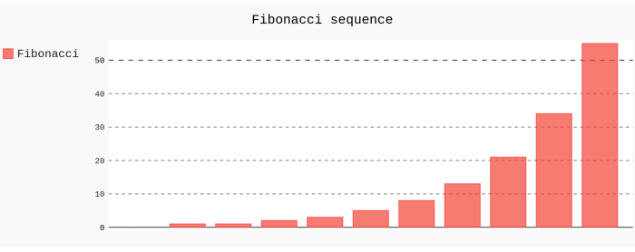

# pygal_bar_chart
Pygal Bar Chart: Python, Flask, pygal, HTML, Jinja2, decorator



## Virtual Environment

This app was originally developed in a Python virtual environment. After Flask and Pygal are installed, this repo can basically be dropped into a virtual environment.

## Run the Application

Navigate to the application's root directory, then enter the following in a Unix-like terminal emulator:

```shell
$ python index.py
```

Then open web browser and navigate to `localhost:3000` or `127.0.0.1:3000`.

## Shebang/Interpreter Directive

The [shebang](https://en.wikipedia.org/wiki/Shebang_(Unix)) is a two-character sequence which represents the magic byte string `0x23` `0x21` encoded from ASCII `#!`. In this case, that _shebang_ string is followed by the path of the Python program loader `/bin/python` which enables the `bar_graph.py` text file to be used as an executable Python script in a Unix-like system. The `/bin/python` segment is known as an _interpreter directive_ in a shebang line.

## Documentation

In the Python interactive shell, the documentation can be accessed:

```python
>>> __doc__
'Renders bar graph to web page based on Fibonacci sequence.'
>>> render_bar_chart.__doc__
'Renders bar graph to web page based on Fibonacci sequence.'
```

The _module_ and _method_ documentation are identical because `render_bar_chart()` is the only method.

## Imports

```
from flask import Flask
from flask import render_template
import pygal
```

 - [Flask()](https://flask.palletsprojects.com/en/1.1.x/api/#flask.Flask) _implements a_ [WSGI application](https://en.wikipedia.org/wiki/Web_Server_Gateway_Interface) (pronounced 'whiskey') which _is a simple calling convention for web servers to forward requests to web applications...written in_ Python.
 - [render_template](https://flask.palletsprojects.com/en/1.1.x/api/#flask.render_template) _Renders a template from the template folder with the given context._
 - [Pygal](http://www.pygal.org/en/stable/) is a charting module.

## Flask Instance

To instantiate a Flask, which _acts as the central object_:

```python
APP = Flask(__name__)
```

## Function Decorator

```python
@APP.route('/')
```

This **decorator** modifies the behavior of `render_bar_chart()` by assigning a URL. `'/'` indicates that the root path was assigned. A user can visit the `APP`'s domain by loading `http://127.0.0.1` or `localhost` in their web browser.

## Function

```python
def render_bar_chart():
    bar_chart = pygal.Bar(height=300)
    bar_chart.title = 'Fibonacci sequence'
    bar_chart.add('Fibonacci', [0, 1, 1, 2, 3, 5, 8, 13, 21, 34, 55])
    chart = bar_chart.render_data_uri()
    return render_template('index.htm', chart=chart)
```

- `def render_bar_chart():` defines the view function which executes following instructions.
- `bar_chart = pygal.Bar(height=300)` instantiates Pygal's Bar class.
- `bar_chart.title = 'Fibonacci sequence'` sets chart's `title`.
- `bar_chart.add('Fibonacci', [0, 1, 1, 2, 3, 5, 8, 13, 21, 34, 55])` adds Fibonacci values to chart.
- `chart = bar_chart.render_data_uri()` renders chart.
- `return render_template('index.htm', chart=chart)` renders Jinja2 template to web browser.

## If Statement

```python
if __name__ == '__main__':
    APP.run(host='localhost', port=3000)  # if standalone
```

If this module runs as a standalone application, then its name in the namespace will be `__main__`:

```python
>>> __name__
'__main__'
```

Otherwise, if `APP` was to be imported into another application, its name would not be `__main__`.
